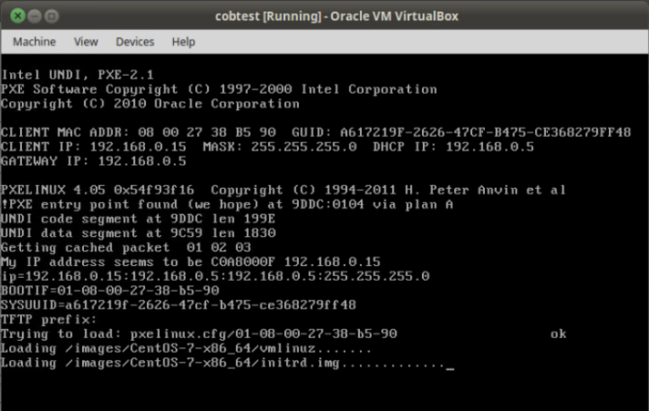

#Centos7安装cobbler
##安装之前的一点说明
Cobbler服务器系统：CentOS7 64位
IP地址：192.168.3.123
子网掩码：255.255.255.0
网关：192.168.3.1
DNS：8.8.8.8 8.8.4.4
所有服务器均支持PXE网络启动
实现目的：通过配置Cobbler服务器，全自动批量安装部署Linux系统
##关闭SELINUX
在安装Cobbler之前最好禁用SELinux和防火墙或者设置防火墙规则。
**关闭SELinux**
``` shell
vim /etc/selinux/config
```
\#SELINUX=enforcing #注释掉
\#SELINUXTYPE=targeted #注释掉
SELINUX=disabled #增加
:wq!  #保存退出
setenforce 0 #使配置立即生效
**关闭防火墙**
``` shell
systemctl stop firewalld
systemctl disable firewalld
```
##安装Cobbler
1.安装最新的epel库
``` shell
rpm -Uvh https://dl.fedoraproject.org/pub/epel/7/x86_64/e/epel-release-7-5.noarch.rpm
```
2.通过yum安装Cobbler以及相关的包
``` shell
yum install cobbler cobbler-web dnsmasq syslinux pykickstart dhcp #安装cobbler
```
3.启动Cobbler
``` shell
[root@cobbler ~]# systemctl enable cobblerd
ln -s '/usr/lib/systemd/system/cobblerd.service' '/etc/systemd/system/multi-user.target.wants/cobblerd.service'
[root@cobbler ~]# systemctl start cobblerd
[root@cobbler ~]# systemctl enable httpd
ln -s '/usr/lib/systemd/system/httpd.service' '/etc/systemd/system/multi-user.target.wants/httpd.service'
[root@cobbler ~]# systemctl start httpd
```
Cobbler-Web提供了一个网站管理服务，默认用户名和密码都是"cobbler",Web浏览地址可以通过以下链接：
https://192.168.3.123/cobbler_web   //注意是https
##配置Cobbler
配置包括改变设置文件。设置cobbler/cobblerd文件在/ etc /cobbler/settings
该文件是一个YAML格式的数据文件。
设置文件里的default_password_crypted控制在kickstart过程中的新系统的超级用户口令。安装新系统的root密码可以通过以下命令进行设置
``` shell
 openssl passwd -1
```
为了PXE启动，你需要一台DHCP服务器分发的地址，并指示引导系统到TFTP服务器在那里可以下载网络引导文件.Cobbler可以通过manage_dhcp这个设置来进行设置。
server选项设置将用于Cobbler服务器的地址的IP。
next_server选项用于DHCP / PXE TFTP服务器的IP从网络启动文件下载。
通常，server和next_server都是相同的，设置为本机IP。
设置好的/etc/cobbler/settings文件如下：
``` shell
/etc/cobbler/settings:
default_password_crypted: "{root password for installed systems. Encrypt your own with openssl passwd -1}"
manage_dhcp: 1
manage_dns: 1
pxe_just_once: 1
next_server: 192.168.3.123
server: 192.168.3.123
```
/etc/cobbler/modules.conf的配置如下：
``` shell
/etc/cobbler/modules.conf
[dns]
module = manage_dnsmasq
 
[dhcp]
module = manage_dnsmasq
```
DHCP配置信息如下： /etc/cobbler/dhcp.template
``` shell
subnet 192.168.3.1 netmask 255.255.255.0 {
     option routers             192.168.3.1;
     option domain-name-servers 192.168.3.1;
     option subnet-mask         255.255.255.0;
     range dynamic-bootp        192.168.3.1 192.168.3.99;
     default-lease-time         21600;
     max-lease-time             43200;
     next-server                $next_server;
     class "pxeclients" {
          match if substring (option vendor-class-identifier, 0, 9) = "PXEClient";
          if option pxe-system-type = 00:02 {
                  filename "ia64/elilo.efi";
          } else if option pxe-system-type = 00:06 {
                  filename "grub/grub-x86.efi";
          } else if option pxe-system-type = 00:07 {
                  filename "grub/grub-x86_64.efi";
          } else {
                  filename "pxelinux.0";
          }
     }
 
}
``` 
编辑/etc/cobbler/dnsmasq.template配置一个简单的DHCP server
``` shell
/etc/cobbler/dnsmasq.template
...
...
read-ethers
addn-hosts = /var/lib/cobbler/cobbler_hosts
 
dhcp-range=192.168.3.1 192.168.3.99
dhcp-option=3,$next_server
dhcp-lease-max=1000
dhcp-authoritative
dhcp-boot=pxelinux.0
dhcp-boot=net:normalarch,pxelinux.0
dhcp-boot=net:ia64,$elilo
```
最后重启Cobbler service和 xinetd services
``` shell
systemctl restart cobblerd
cobbler check
cobbler sync
systemctl enable xinetd
systemctl start xinetd
```
**cobbler check**这个命令合一帮助检测Cobbler配置目前仍然存在的问题，根据提示修改这些问题，然后同步和重启cobbler即可。

**获取cobbler-loaders**
``` shell
cobbler get-loaders
```
**安装必要组件**
``` shell 
yum install fence-agents
rpm -Uvh ftp://rpmfind.net/linux/epel/6/x86_64/debmirror-2.14-2.el6.noarch.rpm  --nodeps --force
```
后续配置
``` shell
sudo vim /etc/xinetd.d/rsync
# 增加以下内容
service rsync
{

disable = no   #修改为no

socket_type     = stream

wait            = no

user            = root

server          = /usr/bin/rsync

server_args     = --daemon

log_on_failure  += USERID

}
```
修改debmirror配置
sudo vim etc/debmirror.conf
``` shell
# Default config for debmirror

# The config file is a perl script so take care to follow perl syntax.
# Any setting in /etc/debmirror.conf overrides these defaults and
# ~/.debmirror.conf overrides those again. Take only what you need.
#
# The syntax is the same as on the command line and variable names
# loosely match option names. If you don't recognize something here
# then just stick to the command line.
#
# Options specified on the command line override settings in the config
# files.

# Location of the local mirror (use with care)
# $mirrordir="/path/to/mirrordir"

# Output options
$verbose=0;
$progress=0;
$debug=0;

# Download options
$host="archive.ubuntu.com";
$user="anonymous";
$passwd="anonymous@";
$remoteroot="ubuntu";
$download_method="ftp";
# @dists="precise";  #注释掉这个
@sections="main,main/debian-installer,universe,restricted,multiverse";
# @arches="i386";  #注释掉这个
# @ignores="";
# @excludes="";
# @includes="";
# @excludes_deb_section="";
# @limit_priority="";
$omit_suite_symlinks=0;
$skippackages=0;
# @rsync_extra="doc,tools";
$i18n=0;
$getcontents=0;
$do_source=1;
$max_batch=0;

# @di_dists="dists";
# @di_archs="arches";

# Save mirror state between runs; value sets validity of cache in days
$state_cache_days=0;

# Security/Sanity options
$ignore_release_gpg=0;
$ignore_release=0;
$check_md5sums=0;
$ignore_small_errors=0;

# Cleanup
$cleanup=0;
$post_cleanup=1;

# Locking options
$timeout=300;

# Rsync options
$rsync_batch=200;
$rsync_options="-aIL --partial";

# FTP/HTTP options
$passive=0;
# $proxy="http://proxy:port/";

# Dry run
$dry_run=0;

# Don't keep diff files but use them
$diff_mode="use";

# The config file must return true or perl complains.
# Always copy this.
1;
```

##导入Distribution
1.distro导入
``` shell
[root@cobbler ~]# mkdir /mnt/iso
[root@cobbler ~]# mount -o loop /dev/cdrom /mnt/iso   #也可以挂载iso文件
 
[root@cobbler ~]# cobbler import --arch=x86_64 --path=/mnt/iso --name=CentOS-7 
[root@cobbler ~]# cobbler distro list #显示distro
   CentOS-7-x86_64
[root@cobbler ~]# cobbler profile list #显示profile
   CentOS-7-x86_64
[root@cobbler ~]# cobbler distro report --name=CentOS-7-x86_64 #可以显示详细信息

```
可以用相同的方式导入许多系统镜像
每个配置文件都有一个kickstart配置档案和配置文件的默认位置是 /var/lib/cobbler/kickstarts/
kickstarts文件可以设置“text”启动或者“GUI”启动。你可以在Cobbler-web中修改安装配置或者直接在以上路径中修改。
使用自定义kickstarts的命令如下：
``` shell
cobbler profile edit --name=CentOS-7-x86_64 --kickstart=/var/lib/cobbler/kickstarts/CentOS-7.ks
```
##需要安装的机器启动
启动时选择从网络启动会自动寻找本网内的DHCP服务器获取IP然后从Cobbler服务器获取安装文件并自动进行安装。

至此！Cobbler自动安装系统完成！

